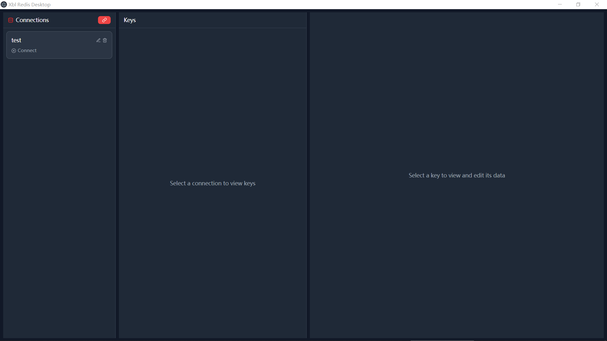
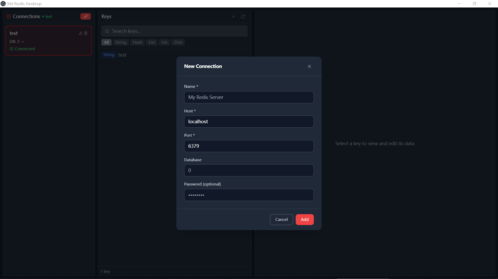
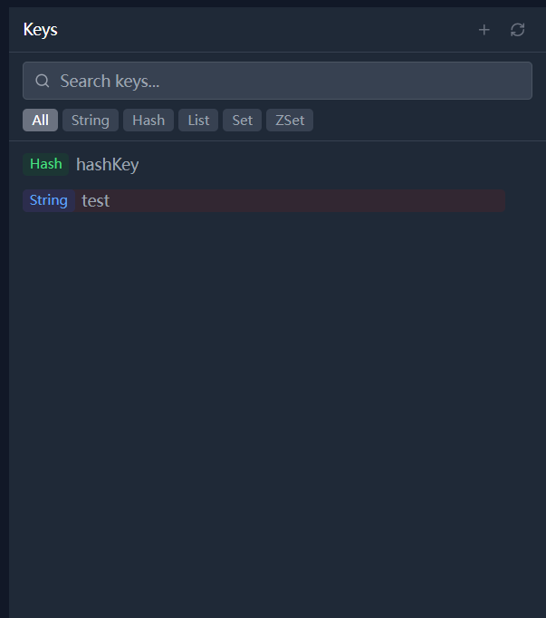
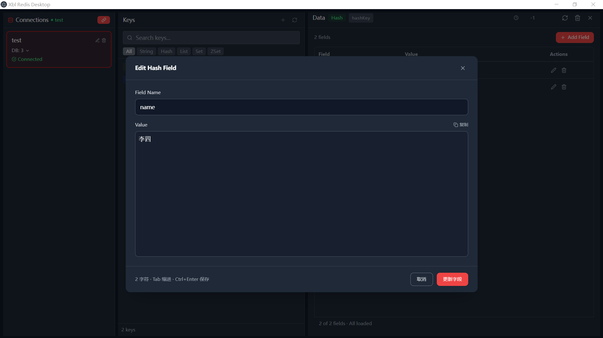

# Xbl Redis Desktop

[](../../releases)
[](../../releases)
[](LICENSE)
[](https://nodejs.org)
[](https://redis.io)

---

A powerful and intuitive Redis desktop management tool to help you easily visualize and manage Redis databases.



---

## Table of Contents

- [Features](#features)
- [Screenshots](#screenshots)
- [Quick Start](#quick-start)
  - [Installation](#installation)
  - [Connect to Redis](#connect-to-redis)
- [User Guide](#user-guide)
  - [Connection Management](#connection-management)
  - [Data Browsing](#data-browsing)
  - [Data Editing](#data-editing)
  - [Search & Filter](#search--filter)
  - [Key Management](#key-management)
- [Data Type Support](#data-type-support)
- [Tech Stack](#tech-stack)
- [Development Guide](#development-guide)
- [FAQ](#faq)
- [Contributing](#contributing)
- [License](#license)
- [Contact](#contact)

---

## Features

### Core Features

- 📊 **Intuitive UI** - Clean three-panel layout design with clear key-value display and fluid operation
- 🔍 **Complete Type Support** - Full support for Redis five core data types
- ✏️ **Inline Editing** - Edit data directly in the interface without switching tools, supports keyboard shortcuts
- 📝 **Perfect Chinese Support** - Supports Chinese data, Chinese key name sorting, avoids garbled text
- 🔄 **Multi-Connection Management** - Manage multiple Redis connections simultaneously with quick switching
- 🎨 **Modern UI** - Modern dark theme interface built with React + Tailwind CSS + Electron
- ⚡ **High Performance** - SCAN-based pagination browsing, won't block Redis server
- 🌳 **Smart Grouping** - Auto-group keys by colon, tree view display, clear hierarchy
- 🔑 **Quick Actions** - Supports keyboard shortcuts for efficient operation
- 💾 **Config Persistence** - Auto-save connection config, restore on next startup

### Data Type Operations

| Data Type | View Mode | Edit Features | Special Features |
|-----------|-----------|---------------|------------------|
| String | Text/JSON/Base64/Hex/URL | Multiple format editing support | Java serialization object viewer |
| Hash | Key-value table | Add/edit/delete fields | Inline editing support |
| List | List form | Add/modify/delete items | Support head/tail insertion |
| Set | Set form | Add/delete members | Auto deduplication |
| ZSet | Sorted list | Add/modify/delete members | Score editing functionality |

---

## Screenshots

### Main Interface


### Connection Panel



### Key Browser



### Data Editor



---

## Quick Start

### Installation

#### Windows Installer

1. Download the latest installer `Xbl Redis Desktop Setup 1.0.0.exe` from [Releases](../../releases)
2. Double-click to run the installer and follow the prompts to complete installation
3. A shortcut will be created on the desktop, click to launch

#### Windows Portable

1. Download the portable version `Xbl Redis Desktop 1.0.0.exe` from [Releases](../../releases)
2. Unzip and run directly, no installation required

**Recommend using portable version** - requires no admin privileges, can be carried on USB drive.

---

## Connect to Redis

### Create New Connection

1. Launch Xbl Redis Desktop
2. Click the "New Connection" button (red link icon) in the top left
3. Fill in connection information:

| Field | Description | Default |
|-------|-------------|---------|
| Name | A recognizable name for the connection | My Redis |
| Host | Redis server address | localhost |
| Port | Redis port | 6379 |
| Database | Database index to connect to | 0 |
| Password | Redis password (optional) | Empty |

4. Click "Add" button to save the connection

### Connect to Server

1. Find the target connection in the connection list
2. Click the "Connect" button to start using
3. Green "Connected" status will display after successful connection

### Switch Database

1. Click the "DB: X" dropdown menu on the connection card
2. Select the database index you want to switch to
3. The tool will automatically reconnect and load keys from the new database

**Tip**: The key count for each database is displayed next to the corresponding DB option.

---

## User Guide

### Connection Management

#### Add Connection

Click the "New Connection" button, fill in connection info and save.

#### Edit Connection

Click the "Edit" icon in the top right of the connection card, modify connection info and save.

#### Delete Connection

Click the "Delete" icon in the top right of the connection card, confirm to delete the connection.

**Note**: Deleting a connection will not delete data on the Redis server, only clears local connection config.

---

### Data Browsing

#### Three-Panel Layout

The application adopts a classic three-panel layout:

- **Left Panel (18.75%)** - Connection management panel
- **Center Panel (31.25%)** - Key browser panel
- **Right Panel (50%)** - Data edit/view panel

#### Key Tree Browsing

The key browser supports tree structure display:

1. Keys are automatically grouped by colon (`:`)
2. Click folder icon to expand/collapse groups
3. Key count is displayed after the folder name
4. Keys are sorted alphabetically for English, then by Pinyin for Chinese

---

### Data Editing

#### String Type Editing

String type supports multiple data formats:

| Format | Description | Use Case |
|--------|-------------|----------|
| Auto | Auto-detect format | General scenarios |
| Raw | Raw text | Plain text |
| JSON | JSON formatted | JSON data |
| Base64 | Base64 encoded | Binary data |
| Hex | Hexadecimal | Binary data viewing |
| URL | URL encoded | URL parameters |

**Edit Operations**:

1. Click "Edit" button to enter edit mode
2. Modify data in the editor
3. Press `Ctrl + Enter` or click "Save" to save

**Shortcuts**:

- `Tab` - Insert two spaces for indentation
- `Ctrl + Enter` - Save changes

---

#### Hash Type Editing

Hash type is displayed in table format, supports:

- **Add Field**: Click "Add Field" button, enter field name and value
- **Edit Field**: Double-click cell to edit directly
- **Delete Field**: Click delete button at row end
- **Batch Operation**: Hold `Ctrl` to select multiple rows for deletion

```json
// Example Hash Data
{
  "name": "张三",
  "age": "25",
  "email": "zhangsan@example.com"
}
```

---

#### List Type Editing

List type is displayed in list format, supports:

- **Add Item**: Add to list head (LPUSH) at top, to tail (RPUSH) at bottom
- **Modify Item**: Double-click list item to edit
- **Delete Item**: Click delete button on the right of the item
- **Batch Delete**: Select multiple rows then click batch delete

```json
// Example List Data
["item1", "item2", "item3", "item4"]
```

---

#### Set Type Editing

Set type displays unordered set members, supports:

- **Add Member**: Enter member value, press Enter or click add
- **Delete Member**: Click delete button on the right of the member
- **Member Deduplication**: Auto-duplicate values

```json
// Example Set Data
["member1", "member2", "member3"]
```

---

#### ZSet Type Editing

ZSet type displays members sorted by score, supports:

- **Add Member**: Enter member value and score (float)
- **Edit Score**: Double-click score value to edit
- **Delete Member**: Click delete button on the right of the member

```json
// Example ZSet Data
[
  {"member": "user1", "score": 100.5},
  {"member": "user2", "score": 89.3},
  {"member": "user3", "score": 75.0}
]
```

---

### Search & Filter

#### Search Keys

Enter keywords in the search box:

- **Real-time Search**: Search as you type, no need to press Enter
- **Fuzzy Matching**: Match any position in key name
- **Case Insensitive**: Default case-insensitive matching

#### Type Filter

Click type filter buttons to quickly filter specific type keys:

- `All` - Show all types keys
- `String` - Show string type only
- `Hash` - Show hash type only
- `List` - Show list type only
- `Set` - Show set type only
- `ZSet` - Show sorted set type only

---

### Key Management

#### Copy Key Name

Double-click key name to copy to clipboard, convenient for use elsewhere.

#### Delete Key

1. Select the key to delete
2. Click "Delete" button (trash icon) in right panel
3. Confirm delete operation

**Warning**: Delete operation cannot be undone, please be careful!

#### Rename Key

Right-click on the key in key browser, select "Rename", enter new name.

#### Set TTL

1. Select a key, you can see TTL display at the top of right panel
2. Click TTL value to edit directly
3. Enter new expiration time (seconds), `-1` means never expire
4. Press `Enter` or click save button to confirm

---

## Data Type Support

### String (Strings)

The most basic data type in Redis, can store any form of string, including:

- Plain text
- JSON data
- Base64 encoded data
- Binary data
- Java serialized objects

**Commands Corresponding**:
- View: `GET key`
- Set: `SET key value`
- Others: `SETEX`, `SETNX`, `INCR`, `DECR` etc.

---

### Hash (Hash Tables)

Suitable for storing object-type data, structure is key-value pair collection.

**Commands Corresponding**:
- View all: `HGETALL key`
- Get field: `HGET key field`
- Set field: `HSET key field value`
- Delete field: `HDEL key field`
- Field count: `HLEN key`

**Use Cases**:
- User info storage: `user:123` → `{name: "张三", age: 25}`
- Config info: `config:web` → `{lang: "zh-CN", theme: "dark"}`

---

### List (Lists)

String collection sorted by insertion order, supports insertion and pop from both ends.

**Commands Corresponding**:
- Get list: `LRANGE key 0 -1`
- Add left: `LPUSH key value`
- Add right: `RPUSH key value`
- Pop left: `LPOP key`
- Pop right: `RPOP key`
- List length: `LLEN key`

**Use Cases**:
- Message queue: `queue:tasks`
- Latest article list: `articles:latest`
- Log recording: `logs:app`

---

### Set (Sets)

Unordered string collection, automatic deduplication.

**Commands Corresponding**:
- Get members: `SMEMBERS key`
- Add member: `SADD key member`
- Remove member: `SREM key member`
- Member count: `SCARD key`
- Check exists: `SISMEMBER key member`

**Use Cases**:
- Tag system: `tags:article:123`
- Online users: `online:users`
- Common friends: `friends:intersection`

---

### ZSet (Sorted Sets)

Similar to Set, but each member has an associated score, sorted by score.

**Commands Corresponding**:
- Get members: `ZRANGE key 0 -1 WITHSCORES`
- Add member: `ZADD key score member`
- Remove member: `ZREM key member`
- Get score: `ZSCORE key member`
- Get rank: `ZRANK key member`
- Member count: `ZCARD key`

**Use Cases**:
- Leaderboard: `leaderboard:game`
- Priority queue: `queue:priority`
- Scheduled tasks: `jobs:scheduled`

---

## Tech Stack

| Technology | Version |
|------------|---------|
| Frontend Framework | React 18.3.1 |
| Build Tool | Vite 5.2.11 |
| Styling | Tailwind CSS 3.4.3 |
| Desktop Framework | Electron 31.0.0 |
| Language | TypeScript 5.4.5 |
| State Management | Zustand 4.5.2 |
| Redis Client | ioredis 5.4.1 |
| Icon Library | Lucide React 0.400.0 |
| Java Deserialization | java-object-serialization 0.1.2 |

---

## Development Guide

### Environment Requirements

- Node.js 18 or higher
- npm or yarn
- Git

### Clone Repository

```bash
git clone https://github.com/hkall/xbl-redis-desktop.git
cd xbl-redis-desktop
```

### Install Dependencies

```bash
npm install
```

### Development Mode

```bash
npm run electron:dev
```

This will launch Vite dev server and Electron app window with hot reload support.

### Project Structure

```
xbl-redis-desktop/
├── electron/              # Electron main process
│   └── main.cjs           # Main process entry file
├── src/
│   ├── components/        # React components
│   │   ├── viewers/      # Data type viewers
│   │   │   ├── StringViewer.tsx
│   │   │   ├── HashViewer.tsx
│   │   │   ├── ListViewer.tsx
│   │   │   ├── SetViewer.tsx
│   │   │   ├── ZSetViewer.tsx
│   │   │   └── JavaObjectViewer.tsx
│   │   ├── ConnectionPanel.tsx      # Connection management panel
│   │   ├── KeyBrowser.tsx           # Key browser
│   │   ├── DataPanel.tsx            # Data edit panel
│   │   ├── CodeEditor.tsx           # Code editor
│   │   ├── EditableJsonTree.tsx     # Editable JSON tree
│   │   ├── JsonTree.tsx             # JSON tree viewer
│   │   └── ConfirmDialog.tsx        # Confirm dialog
│   ├── services/          # Service layer
│   │   └── redis.ts       # Redis operations wrapper
│   ├── store/             # State management
│   │   └── redisStore.ts  # Zustand store
│   ├── utils/             # Utility functions
│   │   ├── formatter.ts   # Data formatting
│   │   └── deserializer.ts # Data deserialization
│   ├── App.tsx            # Main component
│   └── main.tsx           # Entry file
├── public/                # Static resources
├── package.json
├── tsconfig.json
├── tailwind.config.js
├── vite.config.ts
└── electron-builder.json
```

### Build Package

```bash
npm run electron:build
```

After building, installer and portable version will be output to `dist` directory:

```
dist/
├── Xbl Redis Desktop Setup 1.0.0.exe    # Installer
└── Xbl Redis Desktop 1.0.0.exe           # Portable version
```

---

## FAQ

### Q: What to do if connection fails?

**Answer**: Please check the following points:

1. Is Redis service running?
2. Are host address and port correct?
3. If password is set, confirm password is correct
4. Check firewall settings
5. If connecting to remote server, confirm server allows remote connections

---

### Q: Chinese text shows garbled?

**Answer**: Xbl Redis Desktop perfectly supports Chinese. If garbled text appears, please check:

1. Is Redis data stored in UTF-8 encoding?
2. Confirm display settings in app are correct

---

### Q: Does it support connecting to Redis Cluster?

**Answer**: Current version supports Standalone mode only. Cluster and Sentinel modes are under development.

---

### Q: Will data be lost?

**Answer**: Local tool is only for managing Redis data, no additional backup. Please ensure Redis server is configured with persistence (RDB or AOF).

---

### Q: What Redis versions are supported?

**Answer**: Supports Redis 6.0 and above versions.

---

### Q: Can I connect to multiple Redis instances simultaneously?

**Answer**: Yes! Supports managing multiple Redis connections simultaneously with quick switching.

---

### Q: Will it lag when there are too many keys?

**Answer**: No. Application uses SCAN command for pagination, won't block Redis server.

---

## Contributing

We welcome any form of contribution!

### How to Contribute

1. Fork this repository
2. Create your feature branch (`git checkout -b feature/AmazingFeature`)
3. Commit your changes (`git commit -m 'Add some AmazingFeature'`)
4. Push to the branch (`git push origin feature/AmazingFeature`)
5. Open a Pull Request

### Code Standards

- Write code in TypeScript
- Follow ESLint rules
- Use functional components + Hooks
- Use Tailwind CSS for styling
- Use Conventional Commits spec for commit messages

### Bug Feedback

If you encounter problems during use, please:

1. Search if similar issue already exists in [Issues](../../issues)
2. If not, create new Issue, including:
   - Problem description
   - Reproduction steps
   - Expected behavior
   - Actual behavior
   - Environment info (system version, app version, Redis version)
   - Screenshots or logs (if relevant)

---

## License

This project is licensed under the [MIT License](LICENSE).

---

## Contact

- **Author**: hukun
- **Email**: 1181929830@qq.com

---

## Special Thanks

Thanks to the following open source projects. This tool wouldn't be possible without their support:

| Project | Description |
|---------|-------------|
| [Electron](https://www.electronjs.org/) | Cross-platform desktop app framework |
| [React](https://reactjs.org/) | User interface library |
| [Vite](https://vitejs.dev/) | Next-gen frontend build tool |
| [Tailwind CSS](https://tailwindcss.com/) | CSS framework |
| [ioredis](https://github.com/luin/ioredis) | Redis Node.js client |
| [Zustand](https://github.com/pmndrs/zustand) | State management library |
| [Lucide](https://lucide.dev/) | Icon library |
| [TypeScript](https://www.typescriptlang.org/) | JS superset |

---

## Feature Roadmap

### Completed ✅

- [x] Basic connection management
- [x] View and edit five data types
- [x] Key search and filtering
- [x] Tree key browser
- [x] TTL setting
- [x] Config persistence
- [x] Chinese support

### In Progress 🚧

- [ ] Redis Cluster support
- [ ] Redis Sentinel support
- [ ] Data export functionality
- [ ] Data import functionality
- [ ] Command-line execution interface

### Planned 📋

- [ ] Batch data operations
- [ ] Key rename functionality
- [ ] Key move (Rename/Move)
- [ ] Pub/Sub message subscription
- [ ] Slow query analysis
- [ ] Memory usage statistics
- [ ] Multi-language support (Japanese, French, etc.)

---

## Star History

If this project helps you, please give us a ⭐️ Star!

[](https://star-history.com/#your-username/xbl-redis-desktop&Date)

---

**Xbl Redis Desktop** - Making Redis management simpler and more efficient!

> [Back to Top](#xbl-redis-desktop)